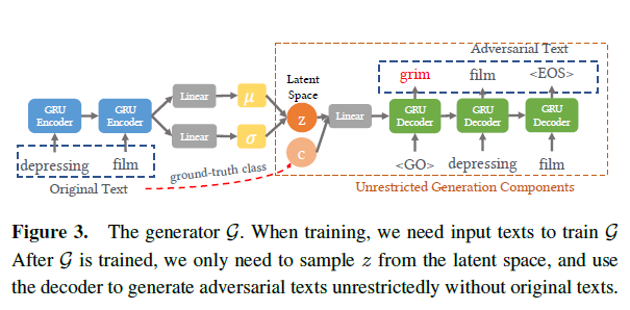

Natural Language Adversarial Sample Generation
---
### Model Architecture

+ Overall Model Architecture : cVAE + GAN

+ Generator : we implemented two generators respectively with LSTM and GRU (folders: LSTM_VAE and GRU_VAE).

### Model Results
current results are not ideal enough but you can distinguish positive results from negative ones as below.
+ positive:
    + i movie is a of the best films ever ever seen it i the was it to lot of watch a the i <UNK> <UNK> was and seen it lot of the the the movie was the movie of not a lot of the and own is i to be a and <UNK> and the it <UNK> thing movie is a the the i was enjoyed to see it <UNK> and have not i to the the movie the <UNK> i and lot times ago to i a <UNK> and movie is <UNK> the i a that the the <EOS> <EOS>

+ negative:
    + i this is a of the worst movies ever ever seen the i was it seen favorite was <UNK> have a disappointed and of the <UNK> and the minutes of i be the the and was a funny and and existent <UNK> have the and the not are <UNK> the and <UNK> are know the the as the <UNK> and the of the <UNK> and and the and the <UNK> the and <UNK> are have the of <UNK> and <UNK> <UNK> <UNK> <UNK> <UNK> of the <UNK> of <UNK> the <UNK> the is the that and <UNK> and br <EOS> <EOS>
    
### Data and Pre-training
+ We use the dataset IMDB(25,000 movies reviews, positive comments and negative comments account for half of each).
+ We have trained a textCNN model as the target model, the accuracy of which reaches 98.4%.

### Training and evaluation
+ Train
    + Run the file `train_with_LSTM.py`(recommended because we have trained once) or `train_with_GRU.py` to train the model with a LSTM/GRU generator.
+ Evaluation
    + Run the file `evaluation.py` to evaluate the model from three aspects: generation speed, text quality and attack success rate.

### Reference
+ [1] [Generating Natural Language Adversarial Examples on a Large Scale with Generative Models](https://arxiv.org/abs/2003.10388 "Generating Natural Language Adversarial Examples on a Large Scale with Generative Models")
+ [2] [CATEGORICAL REPARAMETERIZATION WITH GUMBEL-SOFTMAX](https://arxiv.org/abs/1611.01144, 'Gumbel Softmax')

### Authors
+ Fang Chen
+ Sang Yuchen

### License
+ For academic and non-commercial use only.